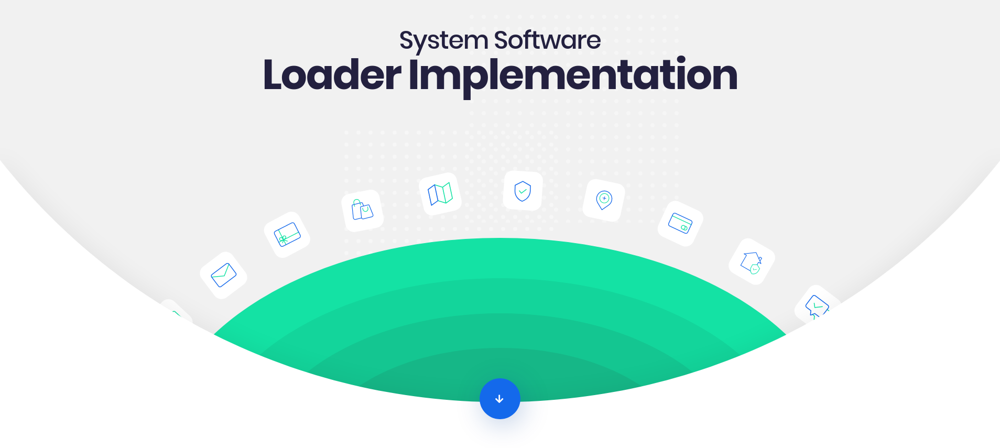
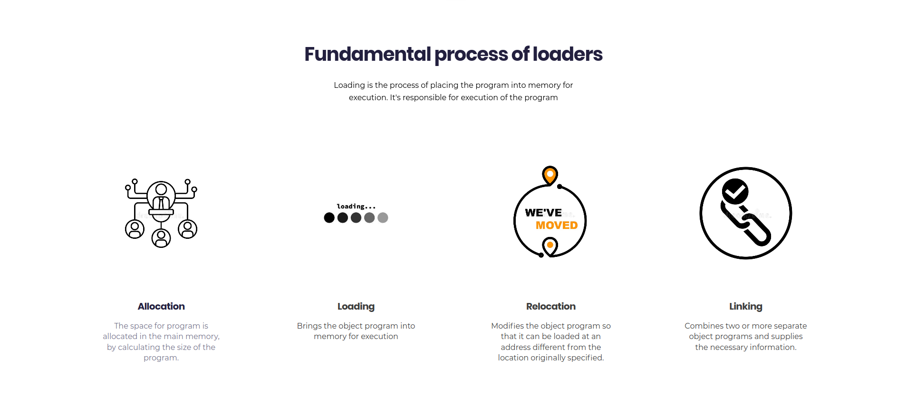
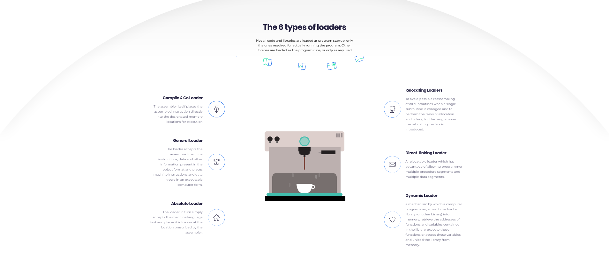

# Simple loader implmentations with a website explaining the same

## Links
* Click to view the [website](https://ss_mini.surge.sh)

## Components 

1. Loader implementation: Contains the C programs
   1. Relative/Relocation loader
   2. Absolute loader

2. Website
   1. Contains the website with all it's assets
   2. Transpiled with Babel
   3. Bundled with Webpack

## Future improvements

1. Implementing more laoders
2. Adding interactivity to the website by allowing users to run different loaders with their own inputs
3. Creating animations and interactive static webpages which explain different loaders and their components for low-end devices
4. Adding build tool configurations and details

## Sample Input and Output Files

1. Absolute loaders
    > [Input File](./miscellaneous/absolute_input.txt) 
    > [Output File](./miscellaneous/absolute_output.txt)

2. Relative/Relocation loaders
    > [Input File](./miscellaneous/relocation_input.txt) 
    > [Output File](./miscellaneous/relocation_output.txt)

## Contributors 

> Order based on ascending order of name

* Aman Lodha 
* Ambadas
* Anand Bhattacharya
* Anand Halse 

## Sneak-Peak

#### Website

